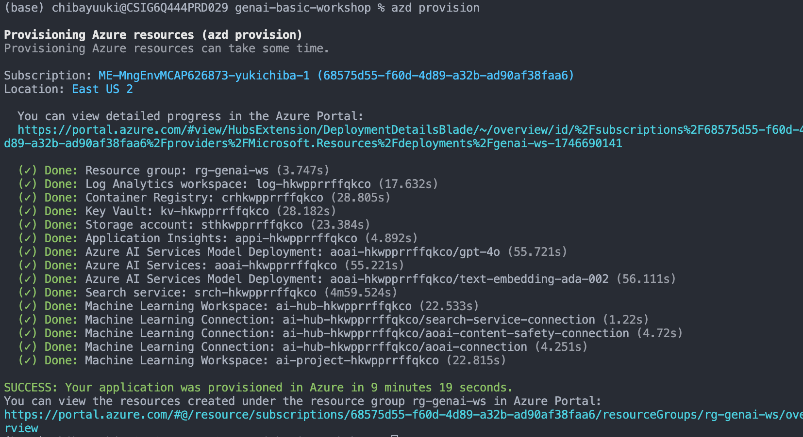

# GenAI Workshop

<p align="center">
  <a href="Readme.ja.md">🇯🇵 日本語</a> &nbsp;|&nbsp;
  <a href="Readme.md">🇺🇸 English</a>
</p>

このリポジトリではAzure OpenAI ServiceやAI Foundaryを利用したGenAI Workshopの補足のデモ環境を用意しています。

## 環境の用意

azdテンプレートを使って環境構築を行います。

```bash
azd auth login
```

```bash
azd provision
```

実行すると下記のようにリソースが作成されます。

