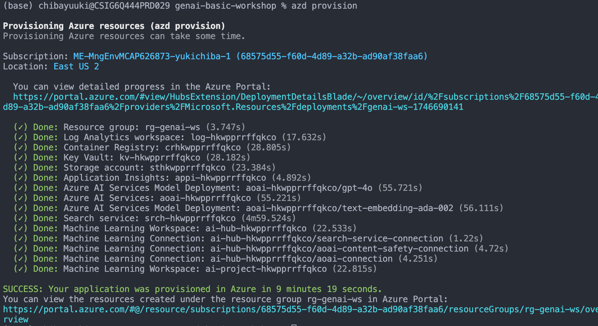

# GenAI Workshop

<p align="center">
  <a href="Readme.ja.md">🇯🇵 日本語</a> &nbsp;|&nbsp;
  <a href="Readme.md">🇺🇸 English</a>
</p>

This repository provides a supplementary demo environment for the GenAI Workshop using Azure OpenAI Service and AI Foundry.

## Setting up the Environment

Set up the environment using the `azd` template.

```bash
azd auth login
```

```bash
azd provision
```

When executed, the following resources will be created:


